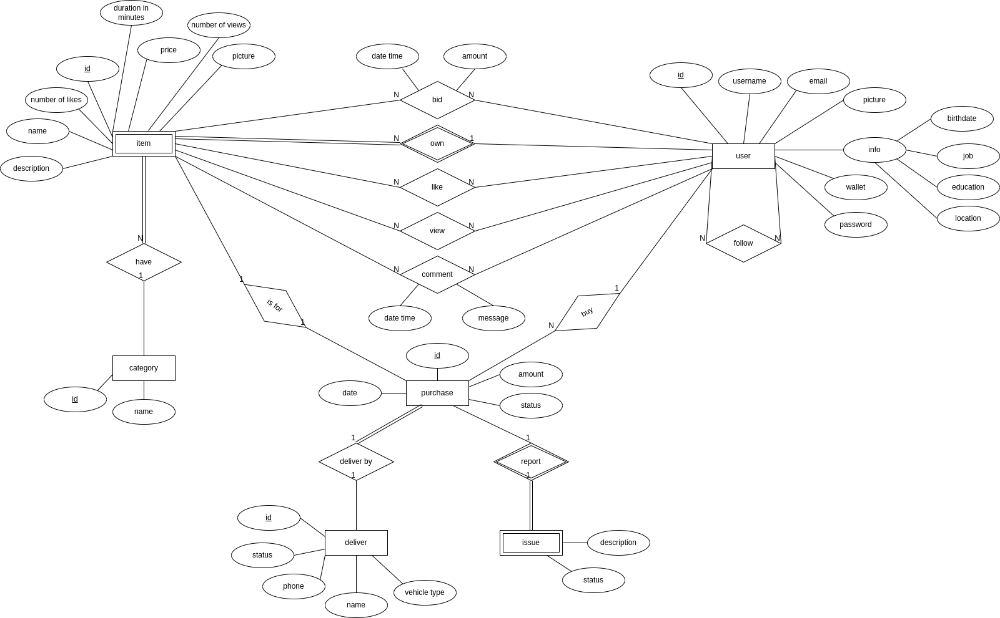

# 🛒 RBay – Online Auction Platform

This repository contains the final project for the **Database Laboratory** course at [Iran University of Science and Technology (IUST)](https://www.iust.ac.ir/en) in Spring 1404 (Persian calendar, 2025), taught by Professor [Dr. Hossein Rahmani](https://webpages.iust.ac.ir/h_rahmani/).

RBay is an online auction platform where users can bid on items, view details, like items, and chat about them. It implements both a **database schema** and a **full-stack web application**.

* ⚙️ **Backend:** Node.js, Express, Sequelize, Redis
* 🎨 **Frontend:** React, Chakra UI, Redux, TanStack Query, Axios
* 🗄️ **Database:** MySQL (with an ER schema design)


## 📑 Table of Contents

- [🛒 RBay – Online Auction Platform](#-rbay--online-auction-platform)
  - [📑 Table of Contents](#-table-of-contents)
  - [✨ Features](#-features)
    - [⚙️ Backend](#️-backend)
    - [🎨 Frontend](#-frontend)
  - [🗄️ Database Design](#️-database-design)
    - [📦 Main Entities](#-main-entities)
    - [🎯 Project Goals](#-project-goals)
    - [📝 Project Tasks](#-project-tasks)
  - [🖼️ ER Schema](#️-er-schema)
  - [⬇️ Installation](#️-installation)
  - [🚀 Usage](#-usage)
    - [⚙️ Backend](#️-backend-1)
    - [🎨 Frontend](#-frontend-1)
  - [🔗 API Endpoints](#-api-endpoints)
    - [🔑 Authentication](#-authentication)
    - [👤 Users](#-users)
    - [📦 Items](#-items)
    - [💬 Chats](#-chats)
  - [Environment Variables](#environment-variables)
  - [👥 Contributors](#-contributors)


## ✨ Features

### ⚙️ Backend

* 🔐 User authentication (signup, login, logout)
* 📦 Create, view, update, and bid on items
* 💬 Chat system per item
* 👍 Like and 👀 view count tracking
* ⚡ Redis caching for performance boost

### 🎨 Frontend

* ⚛️ React SPA with modern UX
* 🎨 Styled with Chakra UI
* 📝 Form handling with `react-hook-form` + Zod validation
* 🗂️ State management using Redux
* 🔄 Data fetching and caching with TanStack Query + Axios
* 🧭 Routing with `react-router-dom`


## 🗄️ Database Design

The platform was designed around a **relational database schema** to support auctions, user interactions, and transaction management.

### 📦 Main Entities

* **Users**: Buyers and sellers with profile info, wallet, followers.
* **Items**: Auctioned products with price, duration, views, likes, and category.
* **Bids**: Price offers per item (history preserved).
* **Comments**: Chat/messages about items.
* **Likes**: Track user interests in items.
* **Views**: Store visits per item.
* **Follows**: Social feature for following sellers or users.
* **ItemIssueReport**: Reports for defective or problematic items.
* **DeliveryPersonnel**: Couriers responsible for delivering purchased items.
* **Purchases** 🧾: Invoice/receipt and payment tracking after auctions close.

### 🎯 Project Goals

1. 🛒 Provide an auction-based sales platform.
2. 💰 Allow bidding (Bid) on items.
3. 🔔 Enable following users and seeing their items.
4. 💬 Support interactions like messages, likes, and views.
5. 💳 Provide an internal wallet for transactions.
6. 📊 Offer analytics on user behavior and sales.
7. ⚠️ Allow reporting defective items and tracking deliveries.

### 📝 Project Tasks

The final project queries are implemented in the file:
`bk/src/DB/sql/final_project_tasks.sql`


## 🖼️ ER Schema

The following diagram represents the **Entity–Relationship (ER) model** of RBay’s database:




## ⬇️ Installation

1. Clone the repository:

   ```bash
   git clone https://github.com/farzaddm/Auction-Site-RBay.git
   cd Auction-Site-RBay
   ```

2. Install backend dependencies:

   ```bash
   npm install
   ```

3. Install frontend dependencies:

   ```bash
   cd fr
   npm install
   ```


## 🚀 Usage

### ⚙️ Backend

1. Set environment variables (see [.env section](#-environment-variables)).
2. Start Redis server:

   ```bash
   redis-server
   ```
3. Run the backend server:

   ```bash
   npm start
   ```

### 🎨 Frontend

1. Navigate to frontend:

   ```bash
   cd fr
   ```
2. Start dev server:

   ```bash
   npm run dev
   ```


## 🔗 API Endpoints

### 🔑 Authentication

* `POST /api/auth/signup` – Sign up
* `POST /api/auth/login` – Log in
* `POST /api/auth/signout` – Log out

### 👤 Users

* `GET /api/users/:id` – Get user details
* `PUT /api/users/:id` – Update user

### 📦 Items

* `POST /api/items` – Create item
* `GET /api/items/:id` – View item
* `POST /api/items/like` – Like an item
* `POST /api/items/view` – Register a view
* `POST /api/items/bid` – Submit a bid
* `GET /api/items/:itemId/bids` – Bid history
* `GET /api/items/sort/price` – Sort by price
* `GET /api/items/sort/duration` – Sort by duration
* `GET /api/items/sort/views` – Sort by recent views

### 💬 Chats

* `GET /api/chats/:itemId` – Get item messages
* `POST /api/chats/:itemId` – Post a message


## Environment Variables

Create a `.env` in the project root:

```env
DB_HOST=your_database_host
DB_PORT=your_database_port
DB_USERNAME=your_database_username
DB_PASSWORD=your_database_password
JWT_SECRET=your_jwt_secret
```


## 👥 Contributors

* [Farzad Dehghan](https://github.com/farzaddm)
* [Mohammad Hosein Pakdaman](https://github.com/mohammadhosein-p)

